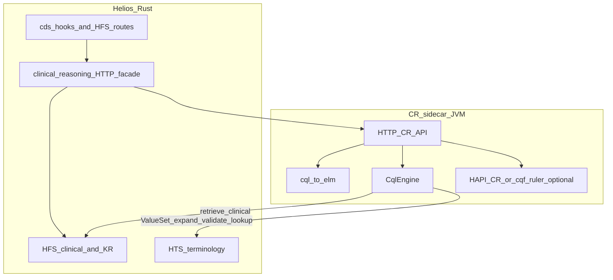

# FHIR Clinical Reasoning: plan review + CQL repo fit

## Alignment with program decisions

The workspace plan **[fhir_clinical_reasoning.plan.md](fhir_clinical_reasoning.plan.md)** is now aligned with:

- **Integration:** **Option B only** — **HTTP sidecar** JVM service; Rust does not embed the CQL engine.
- **Scope:** **CDS Hooks + `Measure/$evaluate-measure` + `PlanDefinition/$apply`** (full CR triad; CQFM/CMS as separate gates).
- **Terminology:** Resolve **`ValueSet/$expand`**, **`$validate-code`**, and **`$lookup`** against **HTS** as the primary FHIR terminology server; the sidecar’s `IGenericClient` may point at HTS for terminology and at HFS for clinical data, **or** use one base URL if HFS proxies terminology—**verify** one contract and stick to it.

## Where to start (recommended sequencing)

**Start in Rust Helios (atrius-hfs), not in this CQFramework clone as your application home.**

- **Why:** CDS Hooks, HFS routes, prefetch, config, auth, and the **HTTP contract** to the sidecar are all **consumer-side** concerns. Defining the façade API and stubbing the sidecar from Helios gives you an end-to-end spine first; the JVM service then implements that contract using jars built from **this** repository (and optionally HAPI CR / cqf-ruler).

**Parallel track (soon after): JVM CR sidecar** — new small service (or module) that depends on Maven-published `cql-to-elm` / `engine` / `engine-fhir` (from this repo) or a local composite build; first milestone: health + one **evaluate expression** endpoint against HFS + HTS URLs.

**Use this repo (`clinical_quality_language`) for:** upstream engine and translator behavior, local `./gradlew build`, **cql-to-elm-cli** in CI for `Library` ELM artifacts, and any CQFramework contributions—not for hosting Helios-specific CDS or `$evaluate-measure` orchestration.

See also **Concrete phases** in [fhir_clinical_reasoning.plan.md](fhir_clinical_reasoning.plan.md) (Phases 1–3 align with Helios first, then sidecar depth).

## What this repository is (and isn’t)

This workspace is the **HL7 CQL reference tooling**: compile CQL to ELM and evaluate ELM. High-level module map ([Src/java/README.md](../../Src/java/README.md)):

| Module | Role for your architecture |
|--------|----------------------------|
| [cql-to-elm](../../Src/java/cql-to-elm) | **Compile-time**: parse CQL, semantic analysis, emit ELM XML/JSON; `LibraryManager` resolves/includes; integrates UCUM and FHIR model info via [quick](../../Src/java/quick) (FHIRHelpers, QI-Core/US Core model info). |
| [engine](../../Src/java/engine) | **Runtime**: `CqlEngine` loads ELM libraries, evaluates named expressions; pluggable retrieve + terminology + data layer. |
| [engine-fhir](../../Src/java/engine-fhir) | **Runtime FHIR adapters**: FHIR-backed **retrieve** (search/query generation) and **terminology** via FHIR operations on a HAPI `IGenericClient`. |
| [elm-fhir](../../Src/java/elm-fhir) | **Tooling**: data requirements / ELM-FHIR utilities; includes helpers like `ElmEvaluationHelper` for wiring a small eval path ([ElmEvaluationHelper.kt](../../Src/java/elm-fhir/src/main/kotlin/org/cqframework/cql/elm/evaluation/ElmEvaluationHelper.kt)). |
| [cql-to-elm-cli](../../Src/java/cql-to-elm-cli) | **CLI** to translate files; useful in CI and IG/package pipelines. |

**Not in this repo:** HTTP FHIR server, `$evaluate-measure`, `PlanDefinition/$apply`, MeasureReport construction, CQF-Ruler–style orchestration, or a Knowledge Repository API. Those layers sit in the **sidecar** (HAPI CR / cqf-ruler / your wrapper) and in **Helios** (HTTP façade, HFS KR).

## How pieces fit together end-to-end

**Interpretation:**

1. **Authoring / packaging:** CQL (and/or ELM) lives in FHIR `Library.content`—**KR-lite** on HFS.
2. **Translation:** [cql-to-elm](../../Src/java/cql-to-elm) produces ELM at build time or in a publish pipeline.
3. **Evaluation:** [CqlEngine](../../Src/java/engine/src/commonMain/kotlin/org/opencds/cqf/cql/engine/execution/CqlEngine.kt) runs ELM **inside the sidecar**; Helios never embeds it.
4. **Terminology:** [R4FhirTerminologyProvider](../../Src/java/engine-fhir/src/main/kotlin/org/opencds/cqf/cql/engine/fhir/terminology/R4FhirTerminologyProvider.kt) issues FHIR **`ValueSet/$expand`**, **`$validate-code`**, and lookup-style calls—**implemented on HTS** in your architecture; confirm HTS responses and ValueSet resolution (url / id / search) match what the provider expects.
5. **Full CR operations:** `$evaluate-measure` and `$apply` are **out of scope for this Git repo alone**; implement or **proxy** them in the sidecar (e.g. HAPI CR stack) and expose them to Helios over HTTP or as HFS-forwarded operations.

## Your Rust components vs this repo

| Your component | Relationship to CQL repo |
|----------------|-------------------------|
| **Helios FHIR server (HFS)** | **Clinical data** + **knowledge artifacts**; primary target for ELM retrieve/search when evaluating against your tenant. May **proxy** terminology to HTS if you prefer a single FHIR base URL for the sidecar. |
| **Helios terminology server (HTS)** | **Primary** FHIR endpoint to verify for **`ValueSet/$expand`**, **`$validate-code`**, **`$lookup`** used by `R4FhirTerminologyProvider`. |
| **Generated FHIR library** | **Parallel type system** to CQFramework modelinfo/HAPI runtime objects; interop at **FHIR JSON + HTTP** (or Bundles passed into the sidecar). |
| **FHIRPath crate** | Complementary; not CQL. |
| **Your FHIR validation** | Orthogonal to ELM evaluation. |
| **CDS Hooks** | **Consumer** of the façade → **sidecar** → cards. |

## Integration option: selected

**Option B — Sidecar HTTP service (locked)**

- One or more JVM HTTP services implement evaluation + (via HAPI CR/cqf-ruler where appropriate) **`$evaluate-measure`** and **`$apply`**.
- Rust **only** orchestrates and calls HTTP.

**Not selected:** In-process JVM embed (Option A); native Rust ELM engine for full parity (Option C).

## Summary

**CDS + `$evaluate-measure` + `$apply`** are all in scope for the product; **this repository** supplies **CQL→ELM and the ELM runtime pieces inside the sidecar**. **HTS** is where you verify ValueSet terminology operations first; **HFS** holds patient/data and artifacts and may optionally unify URLs for the sidecar.
