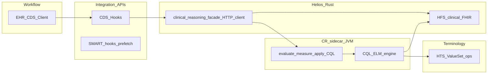

Saved workspace copy (for later reference); originally produced in Cursor plan mode.

**Companion (CQFramework clone module map + sequencing):** [cr_stack_integration_map_75046cd1.plan.md](cr_stack_integration_map_75046cd1.plan.md). **Where to start:** Rust Helios first—define the reasoning façade HTTP contract and wire CDS/HFS to a stub sidecar; then flesh out the JVM sidecar using this repository’s translator/engine (and HAPI CR/cqf-ruler as needed). This clone is for CQL/ELM tooling and upstream fixes, not the Helios app root.

# FHIR Clinical Reasoning beyond CDS Hooks

## How the pieces fit together

[CDS Hooks](https://cds-hooks.hl7.org/) is a **workflow integration** pattern (EHR calls your service at a hook; you return cards). It does **not** define how clinical logic is authored or evaluated. [FHIR Clinical Reasoning](https://build.fhir.org/ig/HL7/fhir-clinicalreasoning/index.html) (CR IG) is the family of specs that standardizes **knowledge artifacts** (how rules are packaged), **execution** (`$evaluate-measure`, PlanDefinition **`$apply`**, Questionnaire population), **metadata** (`$cqfm`, tooling), and optionally a **Knowledge Artifact Repository** (KR) for discovery and packaging.

**Scope (locked for this program):** implement **all** of the following, not a subset: **CDS Hooks** consumption, **`Measure/$evaluate-measure`** (quality reporting), and **`PlanDefinition/$apply`** (workflow/actions). Add CQFM/CMS-style constraints when product or regulatory needs require them.

**Integration (locked):** **Option B — Sidecar HTTP service.** A JVM-based clinical reasoning service runs beside Helios; Rust (CDS, HFS orchestration, gateways) calls it over HTTP. CQL→ELM and ELM evaluation use this repository and/or HAPI Clinical Reasoning / cqf-ruler-style stacks inside that sidecar—**not** an embedded JVM inside the Rust binary.

Conceptual flow:

Your repo today: **[crates/cds-hooks](crates/cds-hooks)** implements CDS **protocol types + `CdsHooksService`** (service side only). **[crates/fhirpath](crates/fhirpath)** implements **FHIRPath**, which overlaps with expression evaluation in CDS/FHIR data layers but is **not** CQL—CQL has different syntax, retrieves, FHIR-aligned data models, ELM interchange, and quality-measure idioms.

## Core CR building blocks

1. **CQL + ELM**  
   - Authoring uses **Clinical Quality Language**. Execution usually consumes **Expression Logical Model (ELM)** XML/JSON compiled by [cql-to-elm](https://github.com/cqframework/clinical_quality_language/tree/master/Src/java) or equivalent.  
   - A **runner** resolves data per CQL retrieves (typically FHIR Bulk Data queries, FHIR `_search`, or packaged Bundles), applies terminology operators, evaluates expressions **Expression**/`Expression` refs on `Library`, and drives `Measure` / `MeasureReport` or CDS outcomes.

2. **Knowledge artifacts (FHIR resources)**  
   - **`Library`** — attaches `content` (CQL text, ELM).  
   - **`PlanDefinition` / `ActivityDefinition`** — workflow and actions; **`$apply`** materializes requests / CarePlans / ServiceRequests etc.  
   - **`Measure` / `MeasureReport`** — quality reporting; **`$evaluate-measure`**.  
   - **`Questionnaire` / `QuestionnaireResponse`** — SDC + CR for forms; population from CQL/Library where applicable.

3. **Knowledge Artifact Repository (KR)**  
   - FHIR IG describes repository behavior: CRUD/search for knowledge resources, versioning, canonical URLs, and packaging operations (`$package`, related parameters) suitable for tooling and dissemination—not only “a database of PDFs”.  
   - Practically this is often a **profiles FHIR server** (R4 tooling) plus automation (FHIR NPM/IG publisher pipeline).

4. **Terminology dependency**  
   - CQL **`in ValueSet`** and related logic need reliable **ValueSet expansion** and code validation. **Helios Terminology Server (HTS)** is the intended implementation of those FHIR terminology operations (**`ValueSet/$expand`**, **`$validate-code`**, **`$lookup`**). The CQFramework **`R4FhirTerminologyProvider`** talks to a FHIR `IGenericClient`; configure that client’s **terminology base URL** to whatever endpoint actually serves those operations—**typically HTS**, or HFS if it **proxies** the same operations to HTS. The first verification todo is **HTS** capability and contract, not “only HFS.”

## CDS Hooks ↔ CR

Recommended pattern: CDS service handlers stay thin; they **gather context** (hook `context`, optional **prefetch** queries against your FHIR API), then call **one internal “reasoning façade”** that is an **HTTP client to the CR sidecar**:

- Inputs: patient id (and hook-specific refs), prefetch Bundle or on-demand FHIR reads, optional **artifact identifiers** (`canonical`/`version`).
- Outputs: CDS **cards**, plus optional SMART app links—the same payloads you already model in [crates/cds-hooks](crates/cds-hooks).

For **`$evaluate-measure`** and **`PlanDefinition/$apply`**, the same façade (or HFS operation routes) forward to the sidecar, which implements or delegates to HAPI CR / cqf-ruler semantics as needed.

## Implementation strategy (locked) and alternatives (not selected)

**Selected: Option B — Sidecar HTTP service**

- Run a JVM service (wrapping `CqlEngine` plus **HAPI Clinical Reasoning and/or cqf-ruler**-class behavior where that reduces duplicate work) that exposes HTTP APIs for:
  - CDS-oriented evaluation (named expressions, library context, patient + optional Bundle),
  - **`Measure/$evaluate-measure`** (or proxy),
  - **`PlanDefinition/$apply`** (or proxy).
- Rust Helios components (**CDS Hooks**, **HFS** routes, gateways) call this service; clinical data reads still go to **HFS**; terminology operations for the engine go to **HTS** (direct from sidecar) **or** via HFS proxy—**verify and document one approach**.
- **Pros:** Clean process boundary, full CR scope without JNI, Rust-first ops with a well-defined JVM island. **Cons:** Two runtimes, network latency, and operational ownership of the sidecar.

**Deferred: Option A — Embed JVM in-process**

- Same libraries, but inside a JVM process; not the chosen path for Helios.

**Deferred: Option C — Native Rust ELM interpreter**

- Only relevant if you later narrow scope to a subset; full `$evaluate-measure` + `$apply` parity in Rust is not the near-term plan.

## Concrete phases aligned to this workspace

**Phase 0 — Boundary and scope**  
- **Done:** Full CR scope — CDS + **`$evaluate-measure`** + **`$apply`**. Track CQFM/CMS as separate product/requirements gates.

**Phase 1 — Knowledge storage and discovery (KR-lite)**  
- Use **HFS** (or dedicated service) CRUD/search for **`Library`, `PlanDefinition`, `Measure`** using existing persistence — resources are already in generated FHIR models under [crates/fhir](../../crates/fhir).  
- Add **CapabilityStatement** entries for whichever operations you support on HFS **and** advertise dependency on the CR sidecar where applicable.  
- Optional: NPM/IG ingestion pipeline outside the Rust process (publisher already produces FHIR Packages).

**Phase 2 — CR sidecar + execution plumbing**  
- Deploy **CR sidecar** (JVM): CQL/ELM from this repo inside it; add HAPI CR / cqf-ruler pieces for measure and plan apply if you are not reimplementing those operations.  
- **`ClinicalReasoning` façade in Rust**: loads artifact identity, builds HTTP requests to sidecar, binds **data** (HFS / Bundle) and **terminology base URL** (HTS or proxy) per sidecar contract.  
- Expose **`$evaluate-measure`** and **`PlanDefinition/$apply`** on HFS as **pass-through** to the sidecar unless the sidecar is called only internally.

**Phase 3 — CDS integration**  
- Implement one end-to-end path: e.g. `patient-view` → prefetch `Patient` + conditions → sidecar evaluates named CQL expression → map results to `Card` types from [crates/cds-hooks/src/models.rs](../../crates/cds-hooks/src/models.rs).

**Phase 4 — Hardening**  
- Caching (ELM, expansion), audit logging, **deduplication** of prefetch, timeouts aligned with CDS expectations, and clear **OperationOutcome** mapping when evaluation fails.

## What not to conflate

- **FHIRPath** (this repo’s [crates/fhirpath](../../crates/fhirpath)): great for field extraction and some invariants; not a substitute for **CQL** or **`$evaluate-measure`**.  
- **HTS**: essential **terminology** for CQL; not a substitute for **`Library`** storage or ELM execution (those stay with KR + sidecar).

## Summary

A comprehensive FHIR Clinical Reasoning module here means **KR + CQL/ELM execution + CR operations** (`$apply`, `$evaluate-measure`) with **CDS Hooks** as one consumer—**all in scope**. **Helios** keeps FHIRPath, validation, and generated models; **HTS** should expose the ValueSet-related FHIR operations the evaluator needs; **HFS** holds clinical data and knowledge artifacts; a **JVM HTTP sidecar** performs (or delegates) evaluation and measure/plan logic so Rust stays an orchestrator, not an ELM runtime.
