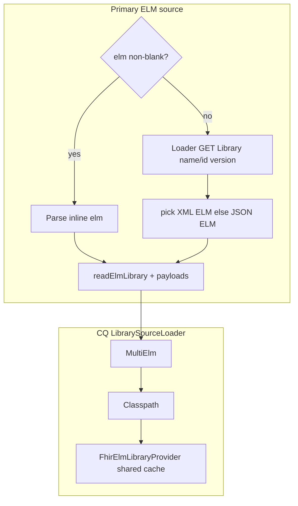

# Primary library from FHIR `Library` (optional inline ELM)

## Precedence (confirmed)

- **Option A:** If **`elm`** is **non-blank**, use it as the **primary** ELM document. FHIR is **not** consulted for the primary in that case; FHIR resolution remains **includes-only after classpath misses**.
- If **`elm`** is **blank/omitted**, load the **primary** from FHIR when **`resolveLibraryArtifactsFromFhir`** is **true** (same **`libraryBaseUrl`** / default-to-**`hfsBaseUrl`** rules as today).

## API ([`Dtos.kt`](src/main/kotlin/com/atrius/sidecar/api/Dtos.kt))

- Change **`elm`** to **`String? = null`** (keep **`elmJson`** alias). Omitting or **`null`** means “fetch primary when FHIR resolution is on.”
- KDoc: document mutual exclusion — inline **`elm`** wins; omit **`elm`** for DB-backed primary.

Validation matrix:

| `elm` | `resolveLibraryArtifactsFromFhir` | Behavior |
|-------|-----------------------------------|----------|
| non-blank | any | Parse **`elm`** as primary; existing **`libraryId`** / **`libraryVersion`** checks unchanged |
| blank | **false** | **`IllegalArgumentException`** — cannot resolve primary without inline ELM |
| blank | **true** | Fetch primary via **`libraryClient`** before building payloads |

## Shared FHIR fetch + cache

[`FhirElmLibrarySourceProvider`](src/main/kotlin/com/atrius/sidecar/cql/FhirElmLibrarySourceProvider.kt) already implements **`GET Library/{id}`** then **`Library?name`/`version`** and **`pickElmAttachmentBytes`**.

Refactor to avoid duplication and double-fetch:

1. Introduce **`FhirLibraryElmLoader`** (or similar name) holding **`IGenericClient`** + **`MutableMap<String, Library>`** (`cacheKey` from [`FhirElmLibrarySourceProvider.kt`](src/main/kotlin/com/atrius/sidecar/cql/FhirElmLibrarySourceProvider.kt)).
2. Methods:
   - **`fun loadLibrary(vid: VersionedIdentifier): Library?`** — move **`fetchLibrary` / read / search / cache** here.
   - **`fun decodePreferredElmString(lib: Library): Pair<String, ElmFormat>`** — prefer ELM XML attachment, else ELM JSON (reuse MIME logic from **`pickElmAttachmentBytes`**); throw **`IllegalArgumentException`** with a clear message if neither exists.
3. **`FhirElmLibrarySourceProvider`** delegates **`cachedLibrary`** / **`fetchLibrary`** to this loader (same cache instance).

## Evaluator flow ([`SidecarEvaluator.kt`](src/main/kotlin/com/atrius/sidecar/cql/SidecarEvaluator.kt))

1. Replace **`require(request.elm.isNotBlank())`** with branching validation above.
2. Create **`fhirContext`** and **`libraryClient`** **early** when **`resolveLibraryArtifactsFromFhir`** is **true** (already partially done); instantiate **`FhirLibraryElmLoader`** + shared cache when client exists.
3. **Resolve primary ELM string + storage format:**
   - **Inline:** `primaryElmString = request.elm!!.trim()` (non-blank), `primaryStorage = resolveElmStorageFormat(..., request.elmFormat)` — unchanged.
   - **Fetched:** Build **`VersionedIdentifier`** from **`request.libraryId`** + **`request.libraryVersion`**; **`library.loadLibrary(vid)`** → **`decodePreferredElmString`**; **`primaryStorage`** derived from chosen **`ElmFormat`** (XML vs JSON).
4. **`readElmLibrary(primaryElmString, ...)`** as today; keep **`libraryId`** / embedded version consistency checks against **`request.libraryId`** / **`request.libraryVersion`**.
5. **`payloads`**: first entry uses **`primaryElmString`** (whether inline or fetched).
6. Register **`FhirElmLibrarySourceProvider`** with loader that shares cache — primary prefetch populates cache so **`resolveLibrary`** does not re-GET the same **`Library`**.

## Docs + tests

- **[`docs/how-it-works.md`](docs/how-it-works.md)** — §1 / §4: optional **`elm`**, precedence, error when blank + FHIR off.
- **[`SidecarEvaluatorTest.kt`](src/test/kotlin/com/atrius/sidecar/cql/SidecarEvaluator.kt)** — existing tests keep passing **`elm`** explicitly.
- Add **`decodePreferredElmString`** unit tests (in-memory **`Library`** + **`Attachment`**) mirroring [`PickElmAttachmentBytesTest.kt`](src/test/kotlin/com/atrius/sidecar/cql/PickElmAttachmentBytesTest.kt) style.

## Out of scope

- Separate **`primaryLibraryFhirId`** when **`Library.id` differs from ELM **`libraryId`** (can add later).
- **`text/cql`** primary attachment (still no compile path).
